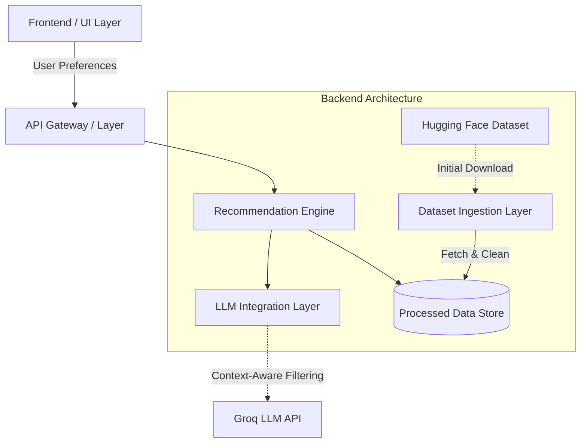

# Zomato – AI Restaurant Recommendation Service Architecture

## 1. System Overview
The Zomato AI Restaurant Recommendation Service is an intelligent system designed to provide hyper-personalized restaurant recommendations. It leverages a comprehensive Zomato restaurant dataset from Hugging Face and integrates a Large Language Model (LLM) to process user preferences (price range, location, minimum rating, cuisine type, and natural language optional preferences) to suggest the most suitable dining options. 

## 2. High-Level Architecture Diagram


## 3. Phases of Implementation
The system will be implemented progressively in the following phases to ensure a stable and scalable deployment. Each phase builds upon the previous one.

### Phase 1: Data Ingestion & Preprocessing
- Setup project infrastructure and environment.
- Download the raw dataset from Hugging Face (`ManikaSaini/zomato-restaurant-recommendation`).
- Clean and normalize the data (handle missing fields, format ratings and prices).
- Store the refined data in a robust persistence layer (e.g., PostgreSQL or a Vector Database like Pinecone/Chroma for vector-based semantic search if utilizing embeddings).

### Phase 2: Core Backend & Recommendation Engine Configuration
- Develop the core API endpoints to receive user queries.
- Implement the baseline recommendation engine using rule-based filtering (filtering by strict bounds like `Location`, `Minimum Rating`, `Cuisine` and `Price Range`).
- Integrate basic logging and error handling.

### Phase 3: Groq LLM Integration Layer
- Integrate the Groq LLM backend to understand and interpret nuanced "Optional Preferences" (e.g., "good for a romantic date but not too loud").
- Enhance the baseline recommendation engine with Groq LLM processing to re-rank filtered results or perform Retrieval-Augmented Generation (RAG).
- Fine-tune prompting strategies so the LLM outputs a structured list of recommendations with reasoning.

### Phase 4: Frontend UI & User Experience
- Develop a comprehensive final UI page to capture structured inputs and unstructured optional preferences.
- Map UI calls to Backend API endpoints.
- Display recommendations clearly including images, ratings, location details, and the custom Groq LLM reasoning/summary.
- Focus strictly on responsive design and an intuitive user experience.

### Phase 5: Personalisation, Analytics, and Evaluation
- Unit testing and Integration testing for Core modules.
- Optimization of Groq LLM response times and implementing caching strategies.
- Setting up LLM Evaluation testing to measure hallucination rates.
- Generating usage analytics, logging user queries, and tracking recommendation success.

### Phase 6: Deployment, DevOps & Environment Management
- Containerization (Docker) to ensure environment consistency.
- Implement CI/CD pipelines (e.g. GitHub Actions) for seamless updates.
- Deploy backend services on platforms like Streamlit Community Cloud, Vercel, or AWS.
- Manage environment variables centrally for security.

## 4. Components of the System

### 4.1. Dataset Ingestion Layer
- **Responsibility:** Ingest the raw Zomato dataset from Hugging Face, clean the data (handling missing values, structuring semi-structured data), generate vector embeddings for unstructured descriptions (if using a vector DB), and load it into the primary datastore periodically or initially.
- **Technologies:** Python, Pandas, HuggingFace `datasets` library.

### 4.2. Backend Architecture & API Layer
- **Responsibility:** Acts as the central hub. Validates user input, coordinates between the UI and the Recommendation Engine, and formats the output. Designed to be stateless and scalable.
- **Technologies:** FastAPI or Flask (Python).
- **Key Endpoints:** 
  - `POST /api/recommend`: Accepts user preferences and returns recommended restaurants.
  - `GET /api/metadata`: Returns valid filter options (e.g., list of valid locations, cuisines) for UI dropdowns.

### 4.3. Recommendation Engine
- **Responsibility:** Performs initial deterministic filtering (using user inputs like SQL queries for location, rating > X, budget) to narrow down the dataset from thousands to a highly relevant subset of candidates. This prevents prompt-bloat and reduces LLM latency/costs.
- **Techniques:** SQL/NoSQL filtering, basic geospatial filtering if coordinates exist.

### 4.4. Groq LLM Integration Layer
- **Responsibility:** Takes the narrowed-down list of restaurant candidates from the Recommendation Engine and the user's unstructured natural language optional preferences. Uses the Groq LLM to evaluate, re-rank, and explain *why* these specific restaurants match the user's vibe or request.
- **Technologies:** LangChain or LlamaIndex, Groq LLM.

### 4.5. UI Layer
- **Responsibility:** Provides the interface for the user to input data (Price range, Location, Min Rating, Cuisine, Optional Preferences) and view the LLM's tailored output.
- **Technologies:** React, Next.js, or Streamlit (for rapid AI prototyping).

## 5. Data Flow
1. **Input:** User submits their criteria (Price range, Location, Min Rating, Cuisine, Optional preferences) via the UI Layer.
2. **API Request:** UI sends an HTTP POST JSON payload to the API Layer.
3. **Hard Filtering:** The API passes criteria to the Recommendation Engine. The engine queries the Database to filter candidates strictly matching location, minimum rating, cuisine, and budget.
4. **Context formulation:** The filtered list of candidate restaurants (in JSON or strict text format) and the user's "Optional Preferences" are formulated into a structured prompt within the Groq LLM Integration Layer.
5. **LLM Processing:** The Groq LLM evaluates the candidates against the nuanced preferences and returns the top 3-5 matches along with personalized explanations.
6. **Response Generation:** The API parses the Groq LLM output into a standardized JSON response and sends it back to the UI.
7. **Display:** UI renders the tailored recommendations for the user.

## 6. Testing Strategy
- **Unit Testing:** Validate individual functions (e.g., data cleaning logic, strict input validation). (pytest)
- **Integration Testing:** Ensure the API layer correctly communicates with the Database and the LLM Integration Layer.
- **LLM Evaluation Testing:** Automated testing to ensure the LLM consistently returns unhallucinated, properly formatted JSON responses using tools like LangSmith or prompt assertions.
- **User Acceptance Testing (UAT):** Verify end-to-end functionality of the UI interacting with the real backend.

## 7. Deployment Strategy
- **Containerization:** Dockerize the backend API, the data ingestion pipelines, and the frontend to ensure environment consistency.
- **Infrastructure:** Deploy backend services on managed platforms such as AWS ECS, Google Cloud Run, or Render.
- **Database:** Managed database services (e.g., AWS RDS/Supabase for structured data, Pinecone/Weaviate if vector search is added).
- **CI/CD:** Use GitHub Actions to automatically lint, test, and deploy code changes.

## 8. Project Folder Structure

```text
zomato-ai-recommendation/
├── dataset/                     # Data processing and DB ingestion scripts
│   ├── fetch_dataset.py         # Script to pull from Hugging Face
│   ├── clean_data.py            # Data normalization logic
│   └── seed_db.py               # Database population scripts
├── backend/                     # Backend API & Business Logic
│   ├── src/
│   │   ├── main.py              # FastAPI application entry point
│   │   ├── api/                 # API route definitions & controllers
│   │   ├── core/                # Config, settings, environment vars
│   │   ├── services/            # Core business logic
│   │   │   ├── db_service.py    # Hard filtering & DB queries
│   │   │   └── llm_service.py   # LLM interaction layer & prompt generation
│   │   └── models/              # Pydantic data models / schemas
│   ├── tests/                   # Backend tests (pytest)
│   └── requirements.txt         # Python dependencies
├── frontend/                    # UI Application
│   ├── public/                  # Static assets
│   ├── src/                     # Source code (React/Next.js)
│   │   ├── components/          # Reusable UI components (Forms, Cards)
│   │   ├── pages/               # Main application views
│   │   └── api/                 # API client calls to internal backend
│   ├── package.json             # Frontend dependencies
│   └── tailwind.config.js       # Styling configuration
├── docker-compose.yml           # Dev-environment orchestration
├── Dockerfile.backend           # Backend container instructions
├── Dockerfile.frontend          # Frontend container instructions
├── .env.example                 # Environment variables template
├── README.md                    # Project documentation
└── ARCHITECTURE.md              # System architecture (This file)
```
